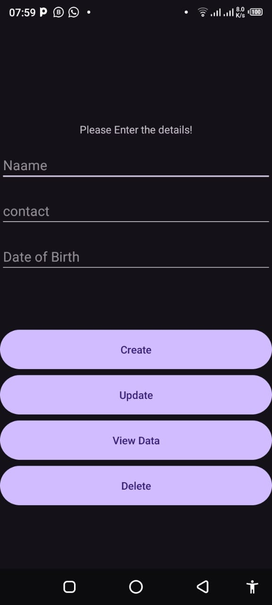

# CRUD SQLite Android App

This is a simple Android application that performs basic CRUD (Create, Read, Update, Delete) operations using SQLite database.

## Features
- **Create**: Add a new user's name, contact, and date of birth.
- **Read**: View all stored user data.
- **Update**: Modify existing user details.
- **Delete**: Remove a user from the database.

## Setup
1. Clone the repository:
    ```bash
    git clone <repository_url>
    ```
2. Open the project in Android Studio.
3. Build and run the app on an emulator or physical device.

## Dependencies
- **SQLite**: Used for local data storage.
- **Android SDK**: Supports modern UI components and interactions.

## Screenshots



- Main screen: User input fields for Name, Contact, and Date of Birth.
- Buttons: Create, Update, View Data, and Delete.

## License
This project is open source and available under the [MIT License](LICENSE).

